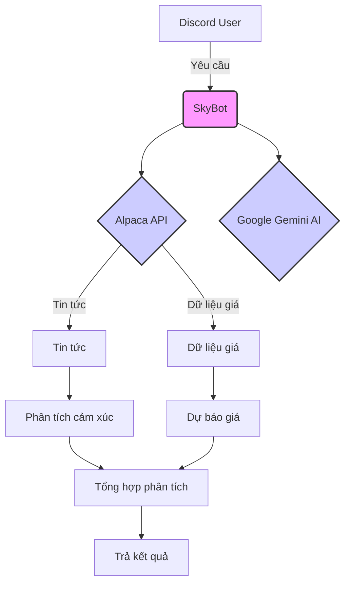

# 📈 SkyBot - Trợ lý Đầu tư Thông minh trên Discord

[](https://opensource.org/licenses/MIT)


SkyBot là một trợ lý ảo thông minh được tích hợp trên Discord, cung cấp các phân tích chứng khoán, dự báo giá cổ phiếu tự động và lời khuyên đầu tư dựa trên AI, kết hợp sức mạnh của trí tuệ nhân tạo và phân tích dữ liệu thị trường. SkyBot giúp bạn đưa ra quyết định đầu tư sáng suốt hơn ngay trên Discord.

## 🌟 Tính năng nổi bật

- **Dự báo giá cổ phiếu chính xác với Prophet:** Sử dụng mô hình Prophet để dự đoán xu hướng giá cổ phiếu trong tương lai.
- **Phân tích cảm xúc thị trường từ tin tức tài chính:** Đánh giá tâm lý thị trường dựa trên các bài viết tin tức tài chính để cung cấp cái nhìn tổng quan về xu hướng.
- **Lời khuyên đầu tư thông minh từ AI:** Nhận các đề xuất đầu tư dựa trên phân tích kỹ thuật, dự báo và tâm lý thị trường, được tạo ra bởi mô hình AI.
- **Hiển thị trực quan với biểu đồ và bảng dữ liệu đẹp mắt:** Xem dữ liệu và kết quả phân tích một cách trực quan thông qua các biểu đồ và bảng được tạo tự động.
- **Tương tác tự nhiên qua Discord:** Dễ dàng truy vấn thông tin và nhận phân tích trực tiếp trong kênh Discord của bạn.
- **Hỗ trợ đa dạng các loại cổ phiếu:** Phân tích và dự báo cho nhiều loại cổ phiếu khác nhau trên thị trường.

## 🛠 Cài đặt

### Yêu cầu hệ thống

- Python 3.8+
- Tài khoản Discord Developer
- API keys từ Alpaca Markets và Google Generative AI

### Các bước cài đặt

**Hướng dẫn cài đặt trên MacOS (tương tự cho Linux):**

1.  **Clone repository:**

    ```bash
    git clone https://github.com/DanielNguyen-05/SkyBot.git
    cd SkyBot
    ```

2.  **Tạo môi trường ảo Python:**

    ```bash
    python3 -m venv .venv
    ```

3.  **Kích hoạt môi trường ảo:**

    ```bash
    source .venv/bin/activate
    ```

4.  **Cài đặt các thư viện cần thiết:**

    ```bash
    make install
    ```

5.  **Chạy SkyBot:**

    ```bash
    make run
    ```

6.  **Dừng SkyBot:**

    ```bash
    Ctrl + C
    ```

7.  **Dọn dẹp (xóa các file tạm):**

    ```bash
    make clean
    ```

**Giải thích các lệnh `make`:**

- `make install`: Chạy `pip install -r requirements.txt` để cài đặt các thư viện được liệt kê trong file `requirements.txt`. Đảm bảo file này tồn tại trong thư mục gốc của dự án và chứa danh sách các thư viện cần thiết (ví dụ: `discord.py`, `pandas`, `prophet`, `google-generativeai`,...).
- `make run`: Chạy lệnh để khởi động bot (ví dụ: `python bot.py` hoặc `python main.py`).
- `make clean`: Xóa các file tạm (ví dụ: file log, file cache). Tùy chỉnh lệnh này để phù hợp với dự án của bạn.

**Quan trọng:**

- Đảm bảo bạn đã cài đặt Python 3.8 trở lên.
- Thay thế `https://github.com/DanielNguyen-05/SkyBot.git` bằng URL repository thực tế của bạn.
- Bạn cần có API keys hợp lệ từ Alpaca Markets và Google Generative AI và cấu hình chúng trong file cấu hình của SkyBot.

## ⚙️ Cấu hình

Trước khi chạy SkyBot, bạn cần cấu hình các thông tin sau:

- **Discord Bot Token:** Lấy từ trang Discord Developer Portal.
- **Alpaca API Key và Secret Key:** Lấy từ tài khoản Alpaca Markets của bạn.
- **Google Generative AI API Key:** Lấy từ Google AI Studio.

Thông tin này thường được lưu trữ trong một file cấu hình riêng (ví dụ: `config.json` hoặc biến môi trường) để bảo mật. Tham khảo tài liệu của SkyBot để biết cách cấu hình chính xác.

## 🧩 Kiến trúc hệ thống



## 📚 Thư viện sử dụng

- **Discord Integration:** `discord.py` (phiên bản 2.0+)
- **Data Analysis:** `pandas`, `numpy`
- **Forecasting:** `prophet`, `mplfinance`
- **AI:** `google-generativeai`, `transformers`
- **Visualization:** `matplotlib`, `seaborn`

## 📂 Các file quan trọng trong dự án

**File** **Mô tả**
bot.py Xử lý tương tác Discord, nhận lệnh và trả lời người dùng.
main.py Luồng phân tích chính, điều phối các chức năng khác nhau (lấy dữ liệu, dự báo, phân tích cảm xúc, tạo lời khuyên).
Forecast.py Chứa các hàm liên quan đến dự báo giá cổ phiếu bằng mô hình Prophet.
Get_Data.py Chứa các hàm để lấy dữ liệu giá cổ phiếu và tin tức tài chính từ Alpaca Markets.
LLMs_Advice.py Chứa các hàm để tạo lời khuyên đầu tư từ các mô hình ngôn ngữ lớn (LLMs) như Google Gemini AI.
Plotting.py Chứa các hàm để tạo biểu đồ và hình ảnh trực quan từ dữ liệu.
requirements.txt Liệt kê tất cả các thư viện Python cần thiết cho dự án. Sử dụng pip freeze > requirements.txt để tạo file này một cách dễ dàng.

## 🚀 Hướng phát triển

- Thêm phân tích kỹ thuật (RSI, MACD, EMA): Tích hợp các chỉ báo kỹ thuật phổ biến để cung cấp phân tích chuyên sâu hơn.
- Hỗ trợ nhiều ngôn ngữ: Mở rộng phạm vi người dùng bằng cách hỗ trợ nhiều ngôn ngữ khác nhau.
- Tích hợp thêm nguồn dữ liệu khác: Kết nối với các nguồn dữ liệu tài chính khác để tăng cường độ chính xác và đa dạng của thông tin.
- Cải thiện giao diện người dùng: Thiết kế các lệnh và phản hồi trực quan, dễ sử dụng hơn trên Discord.
- Tối ưu hóa hiệu suất: Cải thiện tốc độ và hiệu quả của các quy trình phân tích và dự báo.

## 🤝 Đóng góp

- Mọi đóng góp đều được hoan nghênh! Vui lòng tạo Issue để báo cáo lỗi hoặc đề xuất tính năng mới, hoặc tạo Pull Request để đóng góp mã.

<div align="center">
<p>Made with ❤️ by team SkyBros</p>
</div>

**Lưu ý quan trọng:** SkyBot chỉ cung cấp thông tin tham khảo và phân tích, không phải lời khuyên đầu tư tài chính. Hãy tự nghiên cứu kỹ lưỡng và tham khảo ý kiến của chuyên gia trước khi đưa ra bất kỳ quyết định đầu tư nào.

Chúc bạn có 1 trải nghiệm vui vẻ cùng với SkyBot!
